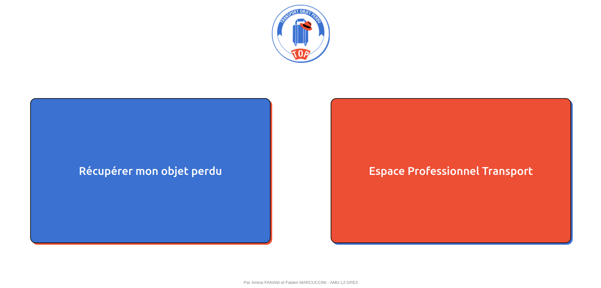
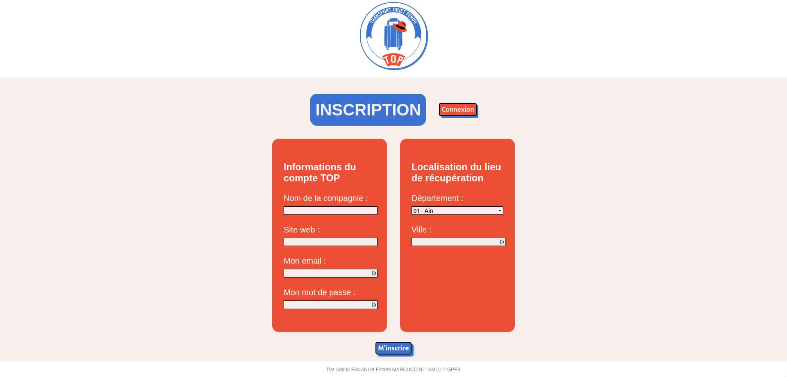
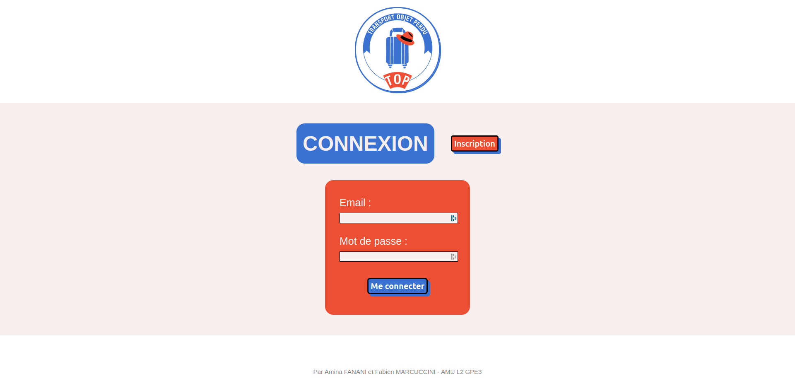
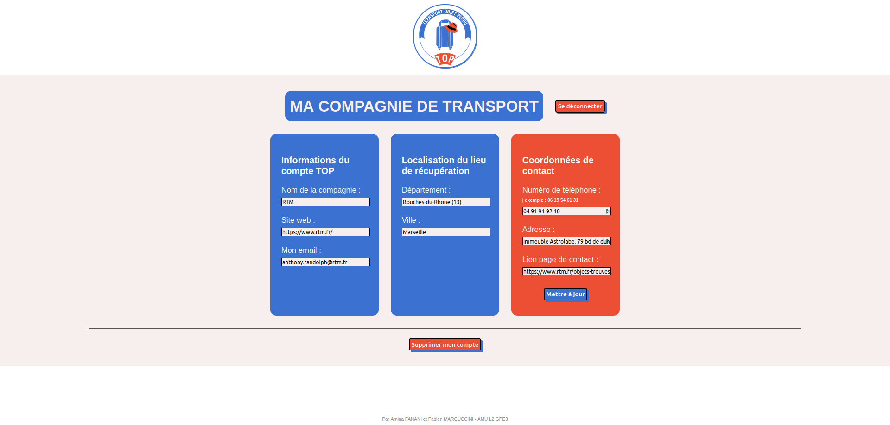
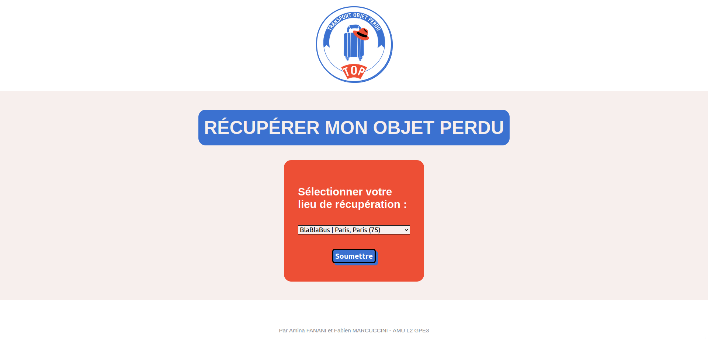
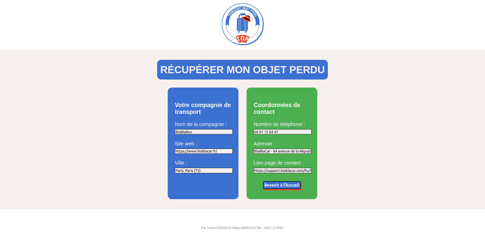

# TOP - Transport Objet Perdu (French Web Application)

## Project Background
**Related Subject:** "Web Development 2023-2024"  at the University of Aix-Marseille 
**Team group:** GP3  
**Team members:** Amina FANANI, Fabien MARCUCCINI 

## Overview
We will develop a web application that allows users to quickly retrieve the contact information of a public transportation company in the event that an item is lost while traveling. To accomplish this, we will use the following technologies that we have studied in class:
<ul>
  <li>HTML (templates);</li>
  <li>CSS;</li>
  <li>JavaScript;</li>
  <li>Flask for the server side (using Python 3);</li>
  <li>SQLite relational database.</li>
</ul>
In accordance with the MVC model, our first goal is to allow transportation companies to register on the site so that they can provide the necessary information for the application's mission. In a second phase, a user who has lost something will be able to fill in a form to select the desired transportation company in order to obtain the contact information of the relevant service.

## User Guide
<ol>
  <li>Install conda: https://docs.anaconda.com/free/miniconda/</li>
  <li>Create an environment (conda create env_name -> conda activate env_name) with:
    <ol>
      <li>Flask (conda install flask)</li>
      <li>requests (conda install requests)</li>
    </ol>
  <li>Run your flask application (flask run --debug)</li>
  <li>Use the link provided by flask in your console, for example "Running on http://127.0.0.1:5000"</li>
</ol>

## Preview
### Route "/"

### Route "/inscription-compagnie-transport"

### Route "/connexion-compagnie-transport"

### Route "/ma-compagnie-de-transport"

### Route "/recuperer-objet-perdu"

